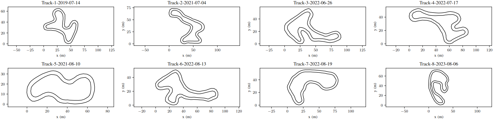

# FSD Racetrack Dataset

This is an open dataset from StarkStrom Augsburg of various racetrack layouts used in Formula Student Driverless. 
We collected this data during test drives using real sensor data, i.e. LiDAR-sensors. 
Currently it contains 9 tracks with their two boundaries and the SLAM-maps. 

# Data Format

The SLAM-maps are a YAML-list of the 2D-positions of every cone, additionally every cone has an ID.
The boundaries are two YAML-lists of ID's. 

The maps may contain false-positives, the ground-truth boundaries were annotated manually.
The accuracy of the cone positions is 0.2m - 0.3m.
# License 

LGPLv3